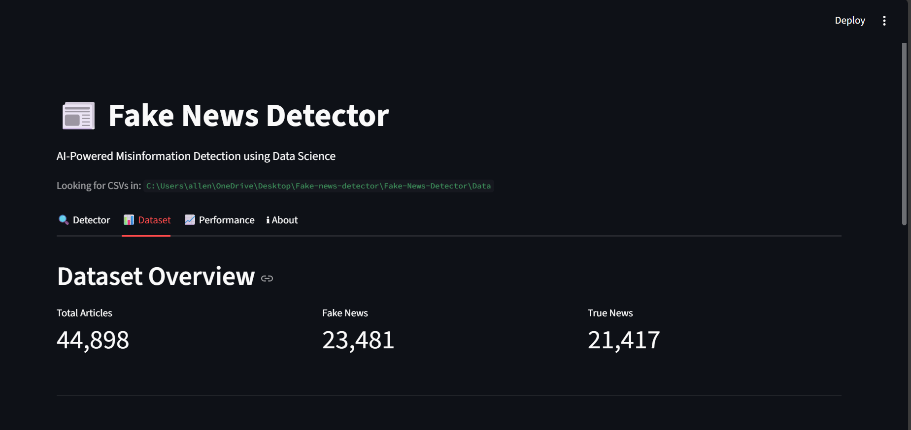
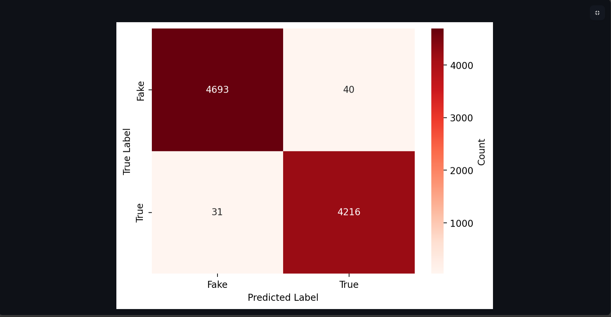
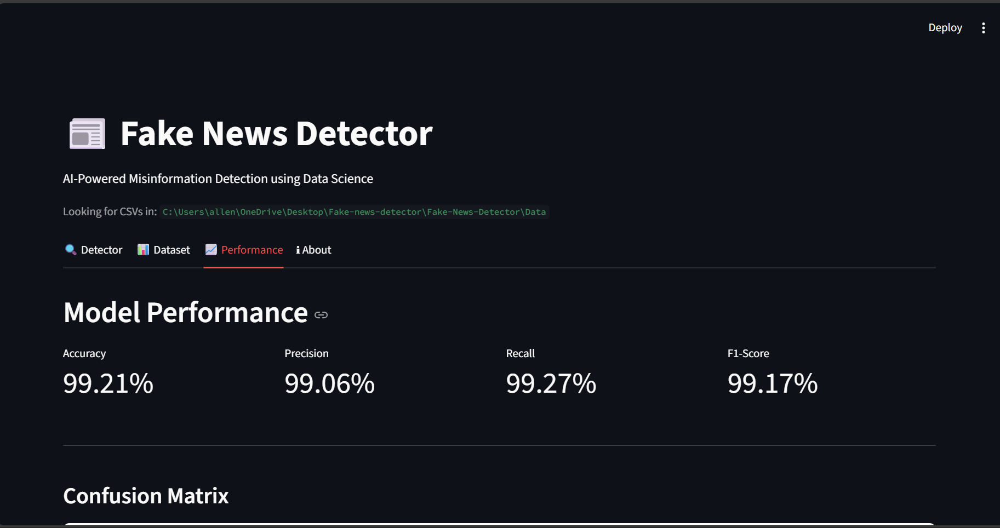
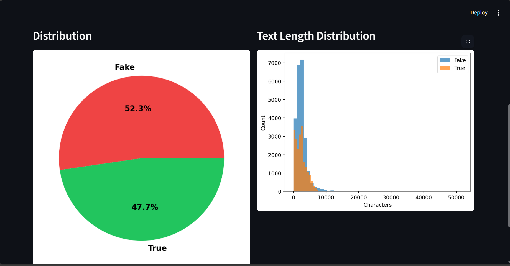

# Fake-News-Detector
This project is a Fake News Detection system built using Natural Language Processing (NLP) and Machine Learning, wrapped inside an interactive Streamlit web application. It analyzes news articles, extracts linguistic features, and uses a trained model to classify content as Real or Fake with confidence scores.

## Project Structure
```
FAKE-NEWS-DETECTOR/
│
├── App/
│   └── app.py                 
│
├── Data/
│   ├── Fake.csv               
│   └── True.csv                
│
├── Images/                     
│   ├── About.png
│   ├── Analyzes.png
│   ├── Confusion Matrix.png
│   ├── Dataset_Overview.png
│   ├── Performance.png
│   └── Visualizations.png
│
├── Notebook/
│   └── fakevstruedetector.ipynb  
│
└── README.md

```
## Features
### Fake News Detector

Enter any news article text

ML model predicts whether it's FAKE or REAL

Confidence %, sentiment features, linguistic insights

Cleaned and preprocessed text for better predictions

### Dataset Overview

Total number of articles

Fake vs. True distribution

Text length distributions

Dataset statistics visualized

### Model Performance

Accuracy, Precision, Recall, F1-Score

Confusion Matrix Heatmap

Real-time model evaluation on test split

### NLP & ML Techniques Used

Text preprocessing (cleaning, tokenization, stopwords)

TF-IDF vectorization

Logistic Regression classifier

Sentiment & subjectivity analysis (TextBlob)

## Screenshot
### Analyzer Interface


### Dataset Overview


### Confusion Matrix


### Model Performance


### Visualizations


### About Page

